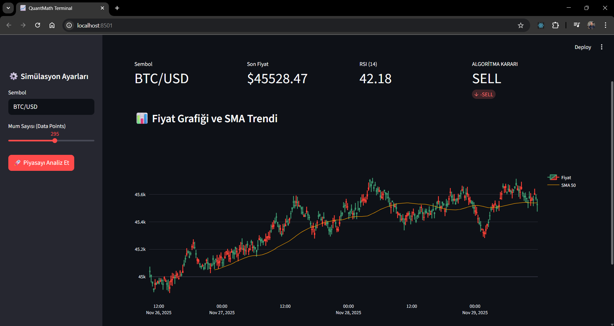

# 📈 QuantMath API: Financial Signal Engine & Dashboard

A high-performance **Quantitative Analysis API** built with **Python (FastAPI)**, featuring an interactive **Streamlit Dashboard** for real-time financial visualization.

## 🖥️ Live Dashboard Preview

The project includes an interactive interface to visualize market data, technical indicators, and buy/sell signals.



## 🚀 Key Features

* **Technical Analysis Core:** Automatically calculates **RSI (14)**, **MACD (12,26,9)**, **SMA (50/200)**, and **Bollinger Bands**.
* **Signal Logic:** Generates `STRONG_BUY`, `BUY`, `NEUTRAL`, `SELL`, or `STRONG_SELL` decisions based on multi-indicator confluence.
* **Vectorized Processing:** Uses **Pandas & NumPy** for high-speed data manipulation.
* **Full-Stack:** Includes both a REST API (FastAPI) and a Frontend Dashboard (Streamlit).

## 🛠️ Tech Stack

* **Backend:** Python 3.10+, FastAPI, Uvicorn
* **Data Science:** Pandas, Pandas-TA, NumPy
* **Frontend:** Streamlit, Plotly
* **Documentation:** Swagger UI (OpenAPI)

## 📦 How to Runß

1.  **Clone the repo:**
    ```bash
    git clone [https://github.com/your-username/quant-math-api.git](https://github.com/your-username/quant-math-api.git)
    ```
2.  **Install dependencies:**
    ```bash
    pip install -r requirements.txt
    ```
3.  **Start API Server:**
    ```bash
    uvicorn main:app --reload
    ```
4.  **Start Dashboard:**
    ```bash
    streamlit run dashboard.py
    ```